rockthemes
================

# 

<!-- badges: start -->

[](https://travis-ci.com/johnmackintosh/rockthemes)


<!-- badges: end -->

## What?

This is a collection of colour palettes based on classic rock album
covers.

Not all of the artists are ‘rock’, but they appeared in lists of classic
rock album covers and the internet is never wrong.

The albums were chosen either for their striking covers (in terms of
colour), or simply, because they are bona fide rock classics.

Your job is to guess which is which.

## Why?

Because [this repo of Metallica inspired
palettes](https://github.com/johnmackintosh/metallicaRt) has been
received quite well on various social media platforms, and I figured
that there were other albums with interesting covers that might provide
more scope for data visualisation purposes.

## Installation

This will probably not go to CRAN, so please install using the remotes
package.

``` r
#library(remotes)
#remotes::install_github("johnmackintosh/rockthemes")
library(rockthemes)
library(ggplot2)
library(dplyr)
#> 
#> Attaching package: 'dplyr'
#> The following objects are masked from 'package:stats':
#> 
#>     filter, lag
#> The following objects are masked from 'package:base':
#> 
#>     intersect, setdiff, setequal, union
library(scales)
library(gapminder)
```

# Palettes and Themes

## Californication

Inspiration

# 

``` r
rock_palette("californication")
```

<!-- -->

## Coltrane

Inspiration

# 

``` r
rock_palette("coltrane")
```

<!-- -->

## Electric

Inspiration

# 

``` r
rock_palette("electric")
```

<!-- -->

## Faith No More

Inspiration

# 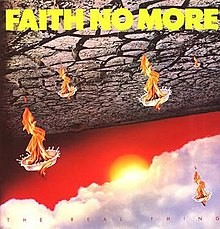

``` r
rock_palette("faithnomore")
```

<!-- -->

## Go Gos

Inspiration

# 

``` r
rock_palette("gogo")
```

<!-- -->

## Guns N’ Roses

Inspiration

# 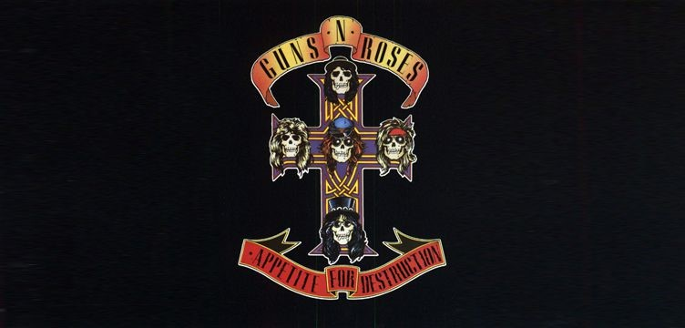

``` r
rock_palette("gunsnroses")
```

<!-- -->

## Slayer

Inspiration

# 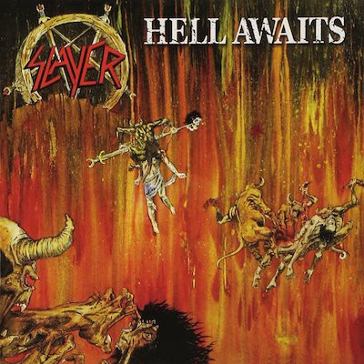

``` r
rock_palette("hellawaits")
```

<!-- -->

## Meagdeth

Inspiration

# 

``` r
rock_palette("peacesells")
```

<!-- -->

## PJ Harvey

Inspiration

# 

``` r
rock_palette("harvey")
```

<!-- -->

## Uria Heep

Inspiration

# 

``` r
rock_palette("heap")
```

<!-- -->

## Husker Du

Inspiration

# 

``` r
rock_palette("husker")
```

<!-- -->

## Janelle Monae

Inspiration

# 

``` r
rock_palette("janelle")
```

<!-- -->

## Iron Maiden

Inspiration

# 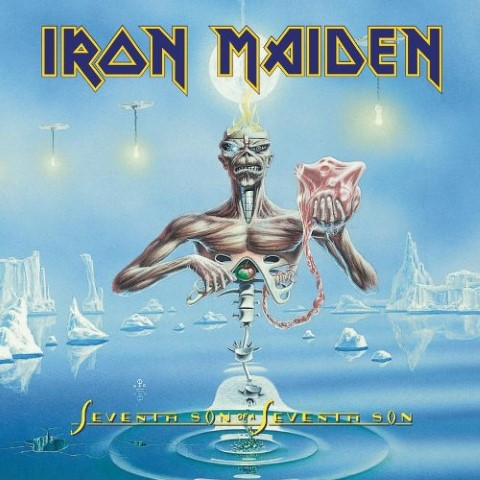

``` r
rock_palette("maiden")
```

<!-- -->

## Metallica

Inspiration

# 

``` r
rock_palette("metallica")
```

<!-- -->

## Miles Davis

Inspiration

# 

``` r
rock_palette("miles")
```

<!-- -->

## Muse

Inspiration

# 

``` r
rock_palette("muse")
```

<!-- -->

## Nirvana

Inspiration

# 

``` r
rock_palette("nevermind")
```

<!-- -->

## No Doubt

Inspiration

# 

``` r
rock_palette("nodoubt")
```

<!-- -->

## Oasis

Inspiration

# 

``` r
rock_palette("oasis")
```

<!-- -->

## Taylor Swift

Inspiration

# 

``` r
rock_palette("swift")
```

<!-- -->

## 10CC

Inspiration

# 

``` r
rock_palette("tencc")
```

<!-- -->

## Longer colour palettes, more suited for ggplot2 use

The following palettes share the same inspirations, but there are more
colours, which hopefully increases their utility for data visualisation.

``` r
show_col(californication_pal()(10))
```

<!-- -->

``` r
show_col(coltrane_pal()(10))
```

<!-- -->

``` r
show_col(electric_pal()(10))
```

<!-- -->

``` r
show_col(gogo_pal()(10))
```

<!-- -->

``` r
show_col(gunsnroses_pal()(10))
```

<!-- -->

``` r
show_col(hellawaits_pal()(10))
```

<!-- -->

``` r
show_col(peacesells_pal()(10))
```

<!-- -->

``` r
show_col(harvey_pal()(10))
```

<!-- -->

``` r
show_col(heap_pal()(10))
```

<!-- -->

``` r
show_col(husker_pal()(10))
```

<!-- -->

``` r
show_col(janelle_pal()(10))
```

<!-- -->

``` r
show_col(maiden_pal()(10))
```

<!-- -->

``` r
show_col(metallica_pal()(10))
```

<!-- -->

``` r
show_col(miles_pal()(10))
```

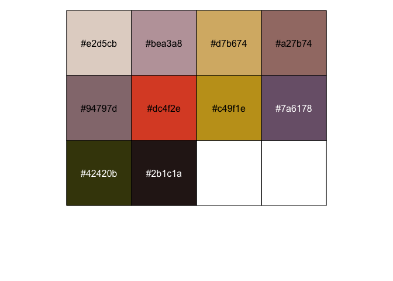<!-- -->

``` r
show_col(muse_pal()(10))
```

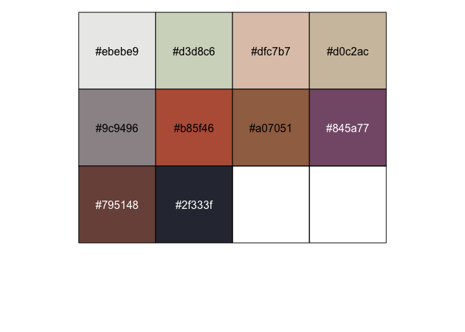<!-- -->

``` r
show_col(nevermind_pal()(10))
```

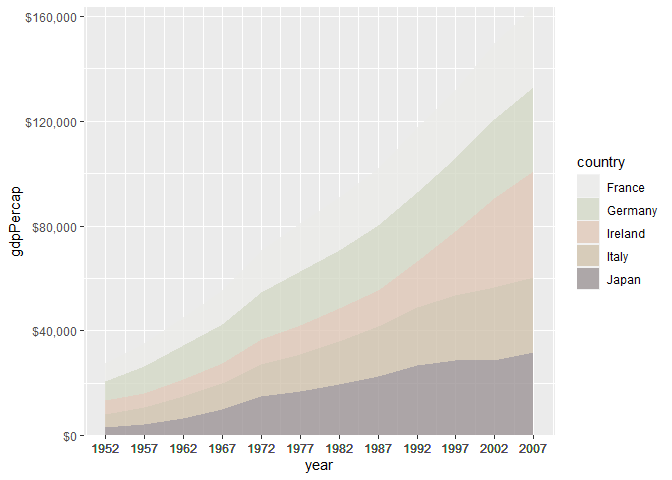<!-- -->

``` r
show_col(nodoubt_pal()(10))
```

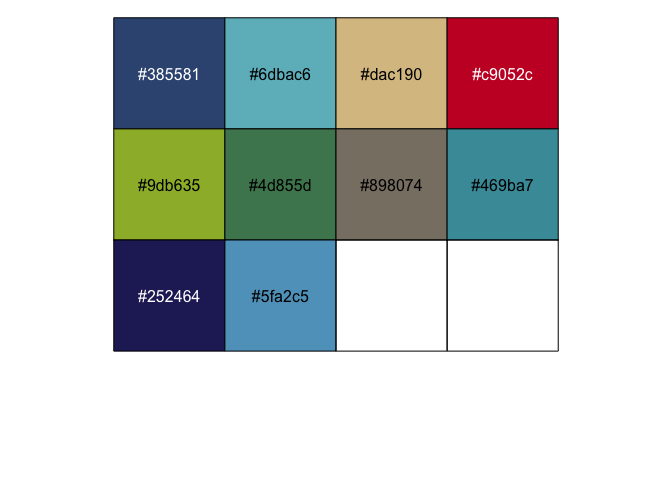<!-- -->

``` r
show_col(oasis_pal()(10))
```

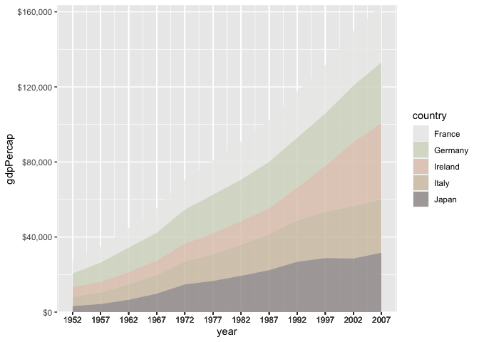<!-- -->

``` r
show_col(real_thing_pal()(10))
```

<!-- -->

``` r
show_col(taylor_pal()(10))
```

<!-- -->

``` r
show_col(tencc_pal()(10))
```

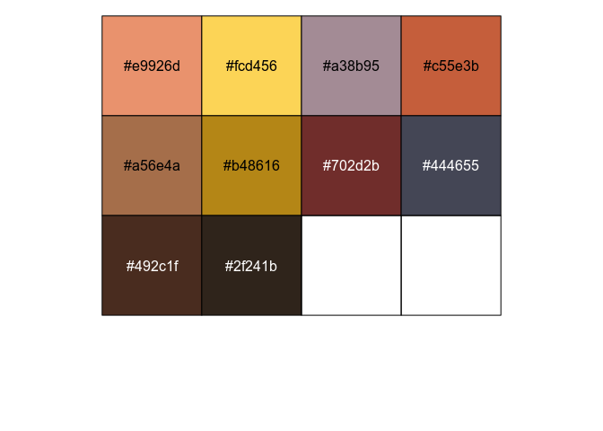<!-- -->

## Credit

[Thanks to Ryo for the tvthemes
package](https://github.com/Ryo-N7/tvthemes) which helped me get this
off the ground quickly

## Code of Conduct

Please note that the rockthemes project is released with a [Contributor
Code of
Conduct](https://contributor-covenant.org/version/2/0/CODE_OF_CONDUCT.html).

By contributing to this project, you agree to abide by its terms.

## Contributing

PR’s are welcome, if you feel there is a glaring omission.

Please include an image of the album cover, relevant code.

Please try to keep artists / albums in chronological order in the
readme.

Don’t forget to update the name param of the rock\_palette function

## More ggplot2 examples

``` r
data <- gapminder::gapminder %>% 
    filter(country %in% c("France", "Germany", "Ireland", "Italy", "Japan")) %>% 
    mutate(year = as.Date(paste(year, "-01-01", sep = "", format = '%Y-%b-%d')))
    
ggplot(data = data, aes(x = year, y = gdpPercap, fill = country)) +
    geom_area(alpha = 0.8) +
    scale_x_date(breaks = data$year, date_labels = "%Y") +
    scale_y_continuous(expand = c(0, 0), labels = scales::dollar) +
    scale_fill_tencc()
```

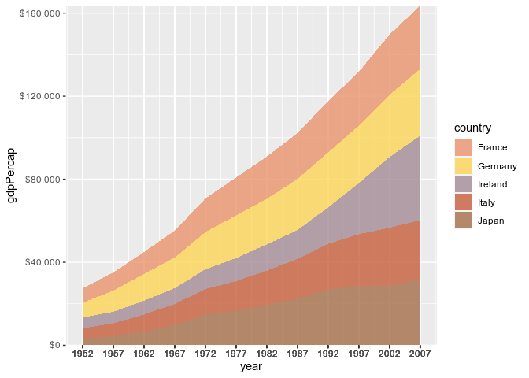<!-- -->

``` r
    
    ggplot(data = data, aes(x = year, y = gdpPercap, fill = country)) +
    geom_area(alpha = 0.8) +
    scale_x_date(breaks = data$year, date_labels = "%Y") +
    scale_y_continuous(expand = c(0, 0), labels = scales::dollar) +
    scale_fill_husker()
```

<!-- -->

``` r
    
    
    ggplot(data = data, aes(x = year, y = gdpPercap, fill = country)) +
    geom_area(alpha = 0.8) +
    scale_x_date(breaks = data$year, date_labels = "%Y") +
    scale_y_continuous(expand = c(0, 0), labels = scales::dollar) +
    scale_fill_janelle()
```

<!-- -->

``` r
  
    ggplot(data = data, aes(x = year, y = gdpPercap, fill = country)) +
    geom_area(alpha = 0.8) +
    scale_x_date(breaks = data$year, date_labels = "%Y") +
    scale_y_continuous(expand = c(0, 0), labels = scales::dollar) +
    scale_fill_muse()
```

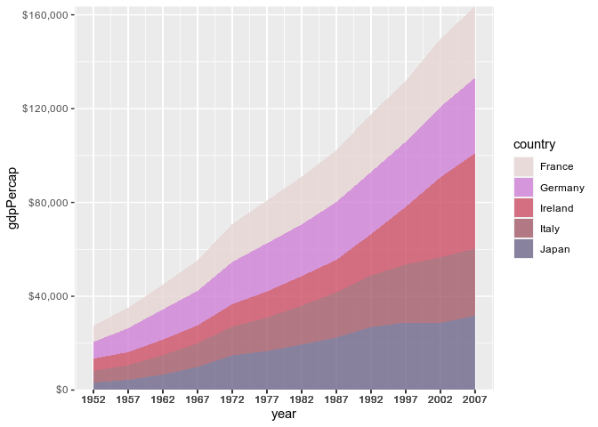<!-- -->

``` r
    
    ggplot(data = data, aes(x = year, y = gdpPercap, fill = country)) +
    geom_area(alpha = 0.8) +
    scale_x_date(breaks = data$year, date_labels = "%Y") +
    scale_y_continuous(expand = c(0, 0), labels = scales::dollar) +
    scale_fill_nodoubt()
```

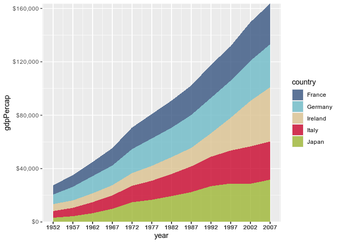<!-- -->
