rockthemes
================

# 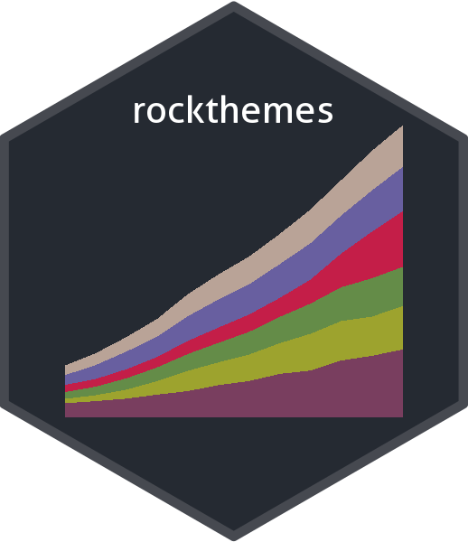

<!-- badges: start -->

[](https://travis-ci.com/johnmackintosh/rockthemes)


[](https://github.com/johnmackintosh/rockthemes/actions)
<!-- badges: end -->

## What?

This is a collection of colour palettes based on classic rock album
covers.

Not all of the artists are ‘rock’, but they appeared in lists of classic
rock album covers and the internet is never wrong, is it ;)

Other albums were chosen either for their striking covers (in terms of
colour), because they are bona fide rock classics, or just because I
like them.

Featuring:

  - Dirt (Alice In Chains, submission by G Hutson)
  - Californication (Red Hot Chili Peppers)
  - Blue Train (John Coltrane)
  - Facelift (Alice In Chains)
  - Groove is in the Heart (Deee-Lite, submitted by R Wilson)
  - Electric (The Cult)
  - To Bring You My Love - P J Harvey
  - The Magician’s Birthday - Uriah Heep
  - Hell Awaits (Slayer - submission by C Beeley)
  - Warehouse Songs and Stories (Husker Du)
  - Dirty Computer (Janelle Monae)
  - Melloncollie and the Infinite Sadness (Smashing Pumpkins, submission
    by C Mainey)
  - Bitches Brew (Miles Davis)
  - Simulation Theory (Muse)
  - Tragic Kingdom (No Doubt)
  - Peace Sells (Megadeth, submission by C Beeley)
  - The 2ND Law (Muse, submission by G Hutson)
  - Siamese Dream (Smashing Pumpkins, submission by C Mainey)
  - The Real Thing (Faith No More)
  - 1989 (Taylor Swift)
  - Celebration Day (Led Zeppelin, submission by G Hutson)

## Why?

Because [this repo of Metallica inspired
palettes](https://github.com/johnmackintosh/metallicaRt) has been
received quite well on various social media platforms, and I figured
that there were other albums with interesting covers that might provide
more scope for data visualisation purposes.

## Installation

This will probably not go to CRAN, so please install using the remotes
package.

``` r
#library(remotes)
#remotes::install_github("johnmackintosh/rockthemes")
library(rockthemes)
library(ggplot2)
library(dplyr)
library(scales)
library(gapminder)
```

# Palettes and Themes

``` r
rock_palette("alice")
rock_palette("californication")
rock_palette("coltrane")
```


``` r
rock_palette("deelite")
rock_palette("electric")
rock_palette("facelift")
```


``` r
rock_palette("faithnomore")
rock_palette("harvey")
rock_palette("heep")
```


``` r
rock_palette("hellawaits")
rock_palette("husker")
rock_palette("janelle")
```

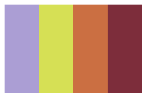

``` r
rock_palette("melloncollie")
rock_palette("miles")
rock_palette("muse")
```


``` r
rock_palette("nodoubt")
rock_palette("peacesells")
rock_palette("secondlaw")
```


``` r
rock_palette("siamesedream")
rock_palette("swift")
rock_palette("zeppelin")
```


## Longer colour palettes, more suited for ggplot2 use

The following palettes share the same inspirations, but there are more
colours, which hopefully increases their utility for data visualisation.

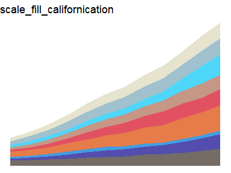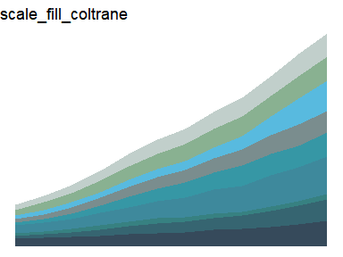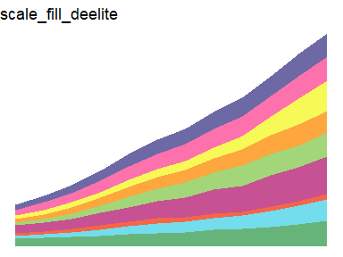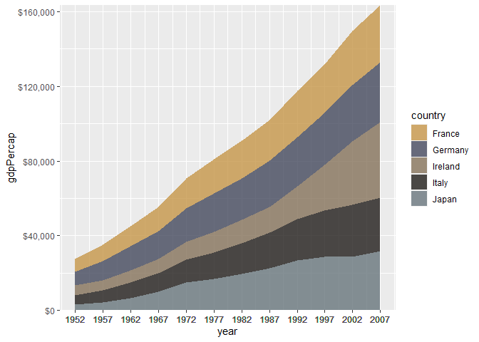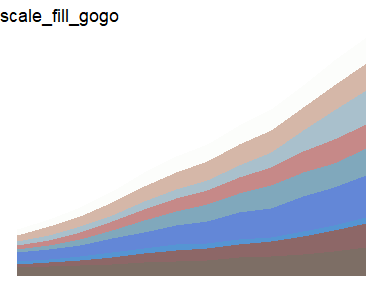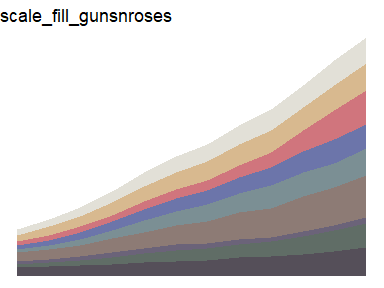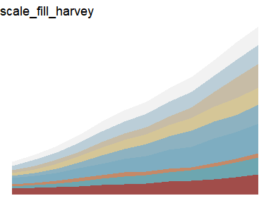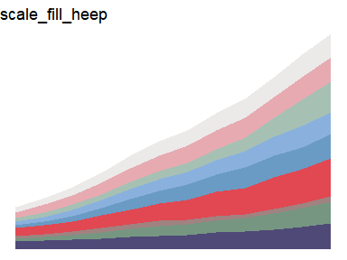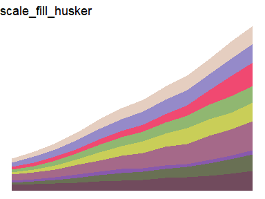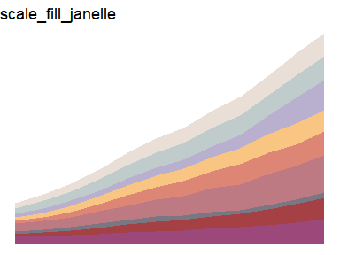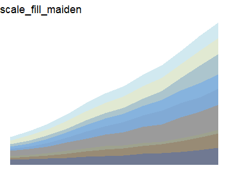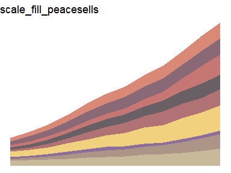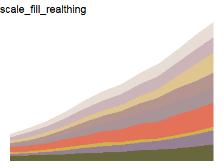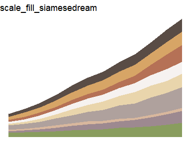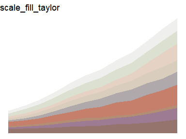

## Credit

[Thanks to Ryo for the tvthemes
package](https://github.com/Ryo-N7/tvthemes) which helped me get this
off the ground quickly

## Code of Conduct

Please note that the rockthemes project is released with a [Contributor
Code of Conduct](CODE_OF_CONDUCT.md). By contributing to this project
you agree to abide by its terms.

## Contributing

See the [Contribution guide](.github/CONTRIBUTING.md)
