rockthemes
================

# 

<!-- badges: start -->

[](https://travis-ci.com/johnmackintosh/rockthemes)


<!-- badges: end -->

## What?

This is a collection of colour palettes based on classic rock album
covers.

Not all of the artists are ‘rock’, but they appeared in lists of classic
rock album covers and the internet is never wrong, is it ;)

The albums were chosen either for their striking covers (in terms of
colour), or simply, because they are bona fide rock classics.

Your job is to guess which is which.

## Why?

Because [this repo of Metallica inspired
palettes](https://github.com/johnmackintosh/metallicaRt) has been
received quite well on various social media platforms, and I figured
that there were other albums with interesting covers that might provide
more scope for data visualisation purposes.

## Installation

This will probably not go to CRAN, so please install using the remotes
package.

``` r
#library(remotes)
#remotes::install_github("johnmackintosh/rockthemes")
library(rockthemes)
library(ggplot2)
library(dplyr)
#> 
#> Attaching package: 'dplyr'
#> The following objects are masked from 'package:stats':
#> 
#>     filter, lag
#> The following objects are masked from 'package:base':
#> 
#>     intersect, setdiff, setequal, union
library(scales)
library(gapminder)
```

# Palettes and Themes

## Abbey Road

Inspiration

# <a href="https://en.wikipedia.org/wiki/File:Beatles_-_Abbey_Road.jpg#/media/File:Beatles_-_Abbey_Road.jpg"></a>

<br><span style="font-size: 10px;"> By Source,
<a href="//en.wikipedia.org/wiki/File:Beatles_-_Abbey_Road.jpg" title="Fair use of copyrighted material in the context of Abbey Road">Fair
use</a>,
<a href="https://en.wikipedia.org/w/index.php?curid=4897516">Link</a></span>

``` r
rock_palette("abbeyroad")
```

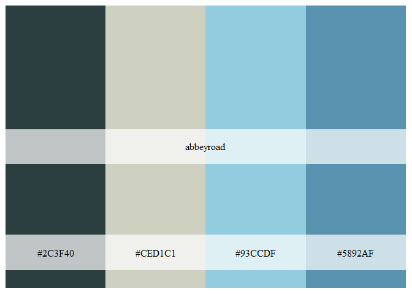<!-- -->

## Californication

Inspiration

# 

``` r
rock_palette("californication")
```

<!-- -->

## Coltrane

Inspiration

# 

``` r
rock_palette("coltrane")
```

<!-- -->

## Electric

Inspiration

# 

``` r
rock_palette("electric")
```

<!-- -->

## Faith No More

Inspiration

# 

``` r
rock_palette("faithnomore")
```

<!-- -->

## Go Gos

Inspiration

# 

``` r
rock_palette("gogo")
```

<!-- -->

## Guns N’ Roses

Inspiration

# 

``` r
rock_palette("gunsnroses")
```

<!-- -->

## PJ Harvey

Inspiration

# 

``` r
rock_palette("harvey")
```

<!-- -->

## Uria Heep

Inspiration

# 

``` r
rock_palette("heep")
```

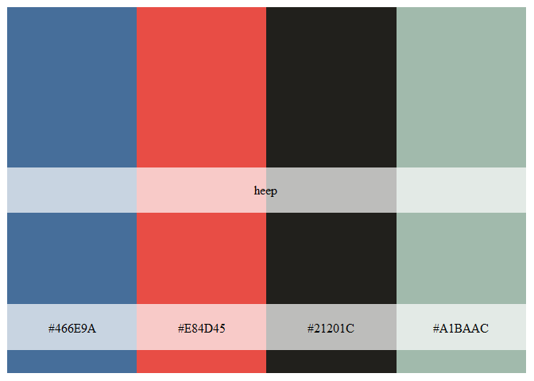<!-- -->

## Hell Awaits - Slayer

Inspiration

# 

``` r
rock_palette("hellawaits")
```

<!-- -->

## Husker Du

Inspiration

# 

``` r
rock_palette("husker")
```

<!-- -->

## Janelle Monae

Inspiration

# 

``` r
rock_palette("janelle")
```

<!-- -->

## Iron Maiden

Inspiration

# 

``` r
rock_palette("maiden")
```

<!-- -->

## Mellon Collie and the Infitine Sadness

Inspiration

# <a href="https://en.wikipedia.org/wiki/File:The_Smashing_Pumpkins_-_Mellon_Collie_And_The_infinite_Sadness.jpg#/media/File:The_Smashing_Pumpkins_-_Mellon_Collie_And_The_infinite_Sadness.jpg"></a>

<br><span style="font-size: 10px;"> By
<span title="must have been published or publicly displayed outside Wikipedia">Source</span>
(<a href="//en.wikipedia.org/wiki/Wikipedia:Non-free_content_criteria#4" title="Wikipedia:Non-free content criteria">WP:NFCC\#4</a>),
<a href="//en.wikipedia.org/wiki/File:The_Smashing_Pumpkins_-_Mellon_Collie_And_The_infinite_Sadness.jpg" title="Fair use of copyrighted material in the context of Mellon Collie and the Infinite Sadness">Fair
use</a>,
<a href="https://en.wikipedia.org/w/index.php?curid=64531870">Link</a></span>

``` r
rock_palette("melloncollie")
```

<!-- -->

## Metallica

Inspiration

# 

``` r
rock_palette("metallica")
```

<!-- -->

## Miles Davis

Inspiration

# 

``` r
rock_palette("miles")
```

<!-- -->

## Muse

Inspiration

# 

``` r
rock_palette("muse")
```

<!-- -->

## Nirvana

Inspiration

# 

``` r
rock_palette("nevermind")
```

<!-- -->

## No Doubt

Inspiration

# 

``` r
rock_palette("nodoubt")
```

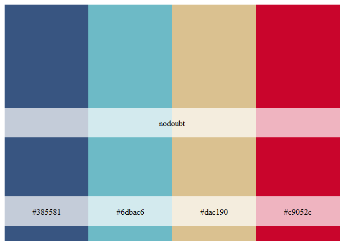<!-- -->

## Oasis

Inspiration

# 

``` r
rock_palette("oasis")
```

<!-- -->

## Peace Sells - Megadeth

Inspiration

# 

``` r
rock_palette("peacesells")
```

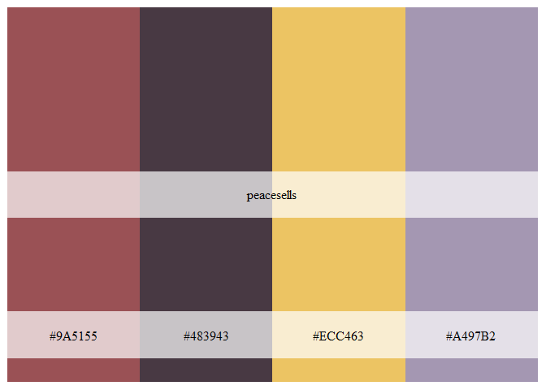<!-- -->

## Siamese Dream

Inspiration

# <a href="https://en.wikipedia.org/wiki/File:SmashingPumpkins-SiameseDream.jpg#/media/File:SmashingPumpkins-SiameseDream.jpg"></a>

<br><span style="font-size: 10px;"> By Source,
<a href="//en.wikipedia.org/wiki/File:SmashingPumpkins-SiameseDream.jpg" title="Fair use of copyrighted material in the context of Siamese Dream">Fair
use</a>,
<a href="https://en.wikipedia.org/w/index.php?curid=224244">Link</a></span>

``` r
rock_palette("siamesedream")
```

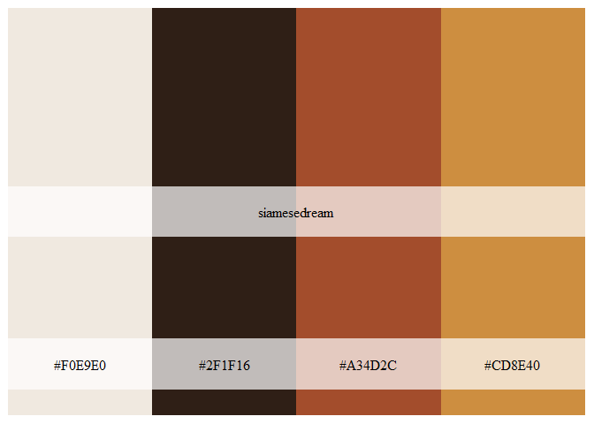<!-- -->

## Taylor Swift

Inspiration

# 

``` r
rock_palette("swift")
```

<!-- -->

## 10CC

Inspiration

# 

``` r
rock_palette("tencc")
```

<!-- -->

## Longer colour palettes, more suited for ggplot2 use

The following palettes share the same inspirations, but there are more
colours, which hopefully increases their utility for data visualisation.

``` r
show_col(abbeyroad_pal()(10))
```

<!-- -->

``` r
show_col(californication_pal()(10))
```

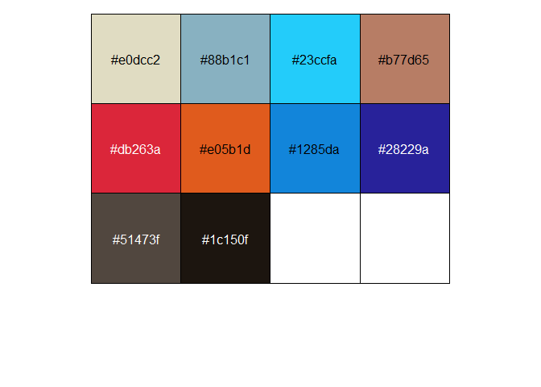<!-- -->

``` r
show_col(coltrane_pal()(10))
```

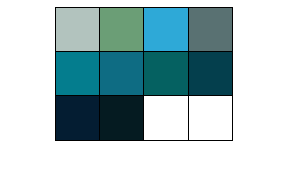<!-- -->

``` r
show_col(electric_pal()(10))
```

<!-- -->

``` r
show_col(gogo_pal()(10))
```

<!-- -->

``` r
show_col(gunsnroses_pal()(10))
```

<!-- -->

``` r
show_col(harvey_pal()(10))
```

<!-- -->

``` r
show_col(heep_pal()(10))
```

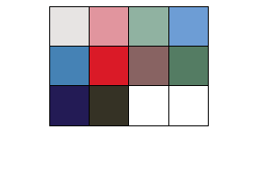<!-- -->

``` r
show_col(hellawaits_pal()(10))
```

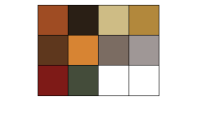<!-- -->

``` r
show_col(husker_pal()(10))
```

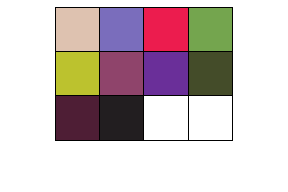<!-- -->

``` r
show_col(janelle_pal()(10))
```

<!-- -->

``` r
show_col(maiden_pal()(10))
```

<!-- -->

``` r
show_col(melloncollie_pal()(10))
```

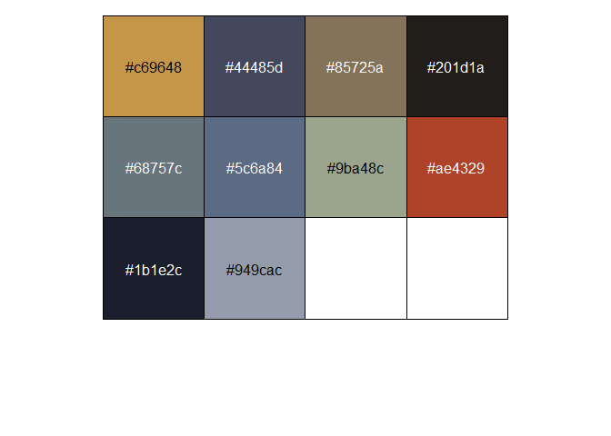<!-- -->

``` r
show_col(metallica_pal()(10))
```

<!-- -->

``` r
show_col(miles_pal()(10))
```

<!-- -->

``` r
show_col(muse_pal()(10))
```

<!-- -->

``` r
show_col(nevermind_pal()(10))
```

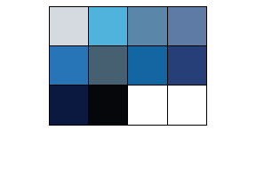<!-- -->

``` r
show_col(nodoubt_pal()(10))
```

<!-- -->

``` r
show_col(oasis_pal()(10))
```

<!-- -->

``` r
show_col(peacesells_pal()(10))
```

<!-- -->

``` r
show_col(real_thing_pal()(10))
```

<!-- -->

``` r
show_col(siamesedream_pal()(10))
```

<!-- -->

``` r
show_col(taylor_pal()(10))
```

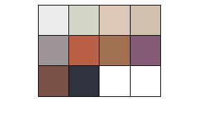<!-- -->

``` r
show_col(tencc_pal()(10))
```

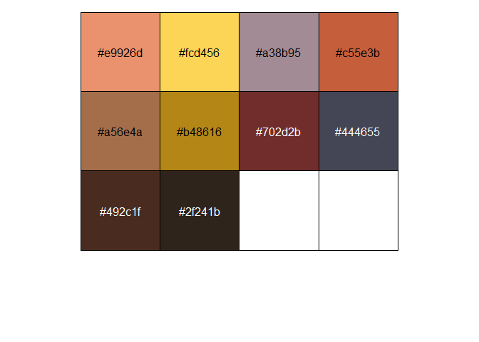<!-- -->

## Credit

[Thanks to Ryo for the tvthemes
package](https://github.com/Ryo-N7/tvthemes) which helped me get this
off the ground quickly

## Code of Conduct

Please note that the rockthemes project is released with a [Contributor
Code of Conduct](CODE_OF_CONDUCT.md). By contributing to this project
you agree to abide by its terms.

## Contributing

See the [Contribution guide](.github/CONTRIBUTING.md)

## More ggplot2 examples

``` r
data <- gapminder::gapminder %>% 
    filter(country %in% c("France", "Germany", "Ireland", "Italy", "Japan")) %>% 
    mutate(year = as.Date(paste(year, "-01-01", sep = "", format = '%Y-%b-%d')))
    
    ggplot(data = data, aes(x = year, y = gdpPercap, fill = country)) +
    geom_area(alpha = 0.8) +
    scale_x_date(breaks = data$year, date_labels = "%Y") +
    scale_y_continuous(expand = c(0, 0), labels = scales::dollar) +
    scale_fill_tencc()
```

<!-- -->

``` r
    
    ggplot(data = data, aes(x = year, y = gdpPercap, fill = country)) +
    geom_area(alpha = 0.8) +
    scale_x_date(breaks = data$year, date_labels = "%Y") +
    scale_y_continuous(expand = c(0, 0), labels = scales::dollar) +
    scale_fill_husker()
```

<!-- -->

``` r
    
    
    ggplot(data = data, aes(x = year, y = gdpPercap, fill = country)) +
    geom_area(alpha = 0.8) +
    scale_x_date(breaks = data$year, date_labels = "%Y") +
    scale_y_continuous(expand = c(0, 0), labels = scales::dollar) +
    scale_fill_janelle()
```

<!-- -->

``` r
    
    ggplot(data = data, aes(x = year, y = gdpPercap, fill = country)) +
    geom_area(alpha = 0.8) +
    scale_x_date(breaks = data$year, date_labels = "%Y") +
    scale_y_continuous(expand = c(0, 0), labels = scales::dollar) +
    scale_fill_melloncollie()
```

<!-- -->

``` r
  
    ggplot(data = data, aes(x = year, y = gdpPercap, fill = country)) +
    geom_area(alpha = 0.8) +
    scale_x_date(breaks = data$year, date_labels = "%Y") +
    scale_y_continuous(expand = c(0, 0), labels = scales::dollar) +
    scale_fill_muse()
```

<!-- -->

``` r
    
    ggplot(data = data, aes(x = year, y = gdpPercap, fill = country)) +
    geom_area(alpha = 0.8) +
    scale_x_date(breaks = data$year, date_labels = "%Y") +
    scale_y_continuous(expand = c(0, 0), labels = scales::dollar) +
    scale_fill_nodoubt()
```

<!-- -->
