rockthemes
================

<!-- badges: start -->

[](https://travis-ci.com/johnmackintosh/rockthemes)
<!-- badges: end -->

## What?

This is a collection of colour palettes based on classic rock album
covers.

Although ‘rock’ may be a stretch in some cases, the albums were chosen
for their appealing covers

## Why?

Because [this repo of Metallica inspired
palettes](https://github.com/johnmackintosh/metallicaRt) has been
received quite well on various social media platforms

## Credit

[Thanks to Ryo for the tvthemes
package](https://github.com/Ryo-N7/tvthemes) which helped me get this
off the ground quickly

## I want this

Of course you do. This will not go to CRAN, so please install using the
remotes package.

``` r
#library(remotes)
#remotes::install_github("johnmackintosh/rockthemes")
library(rockthemes)
#> Warning: replacing previous import 'vctrs::data_frame' by 'tibble::data_frame'
#> when loading 'dplyr'
library(ggplot2)
library(dplyr)
#> 
#> Attaching package: 'dplyr'
#> The following objects are masked from 'package:stats':
#> 
#>     filter, lag
#> The following objects are masked from 'package:base':
#> 
#>     intersect, setdiff, setequal, union
```

## Data Viz Friendly

These mini palettes are lush

``` r
rock_palette("californication")
```

<!-- -->

``` r
rock_palette("coltrane")
```

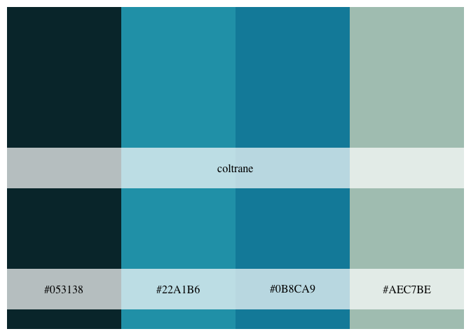<!-- -->

``` r
rock_palette("electric")
```

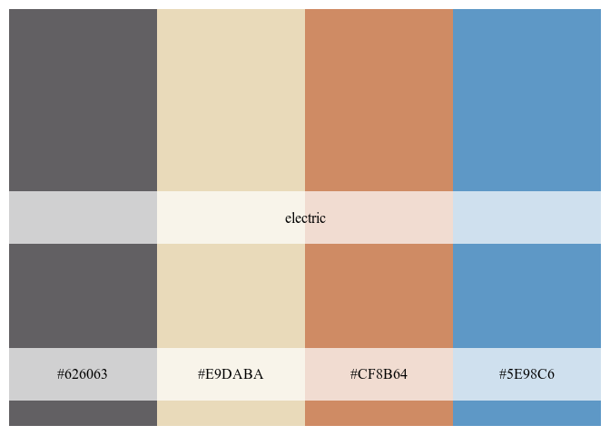<!-- -->

``` r
rock_palette("faithnomore")
```

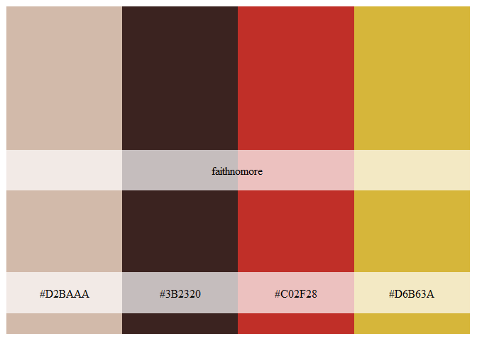<!-- -->

``` r
rock_palette("gogo")
```

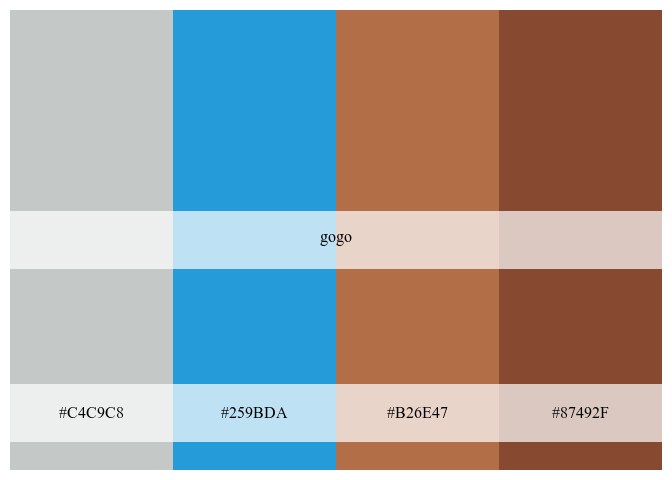<!-- -->

``` r
m <- outer(1:20,1:20,function(x,y) sin(sqrt(x*y)/3))
cols <- rock_palette("gogo")
Lab.palette <- colorRampPalette(cols,space = "Lab")
filled.contour(m, col = Lab.palette(20))
```

<!-- -->

``` r
rock_palette("gunsnroses")
```

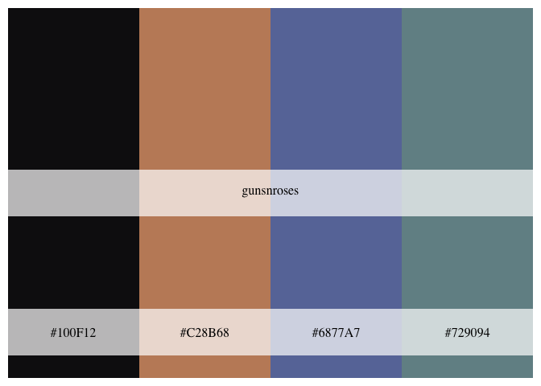<!-- -->

``` r
rock_palette("harvey")
```

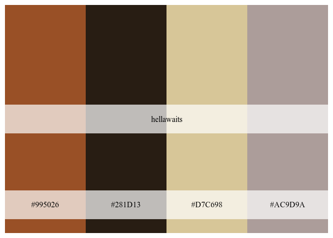<!-- -->

``` r
rock_palette("heap")
```

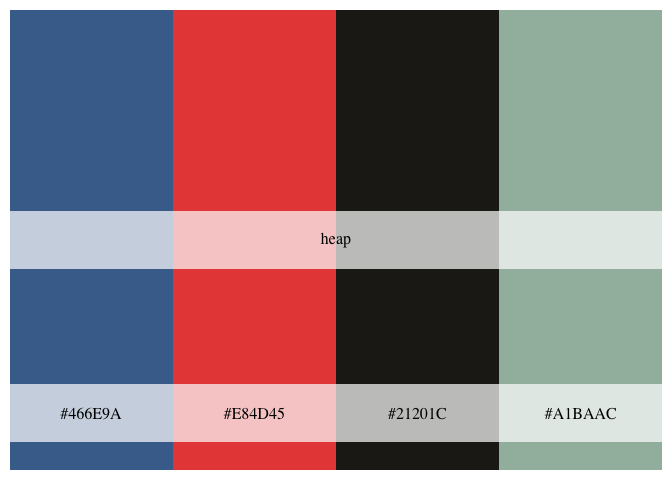<!-- -->

``` r
rock_palette("herb")
```

<!-- -->

``` r
rock_palette("husker")
```

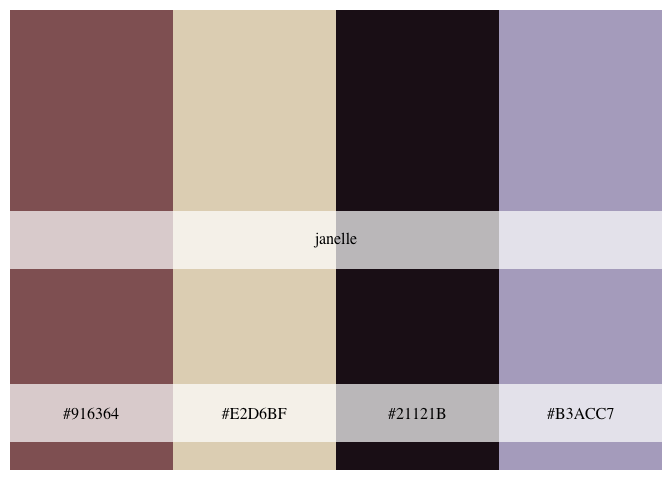<!-- -->

``` r
rock_palette("maiden")
```

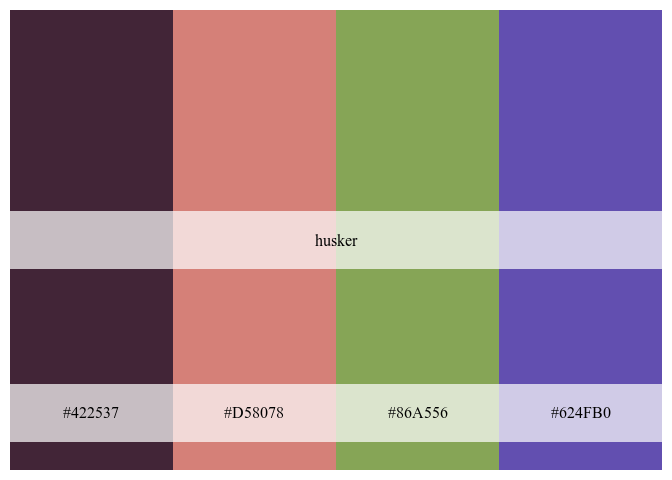<!-- -->

``` r
rock_palette("metallica")
```

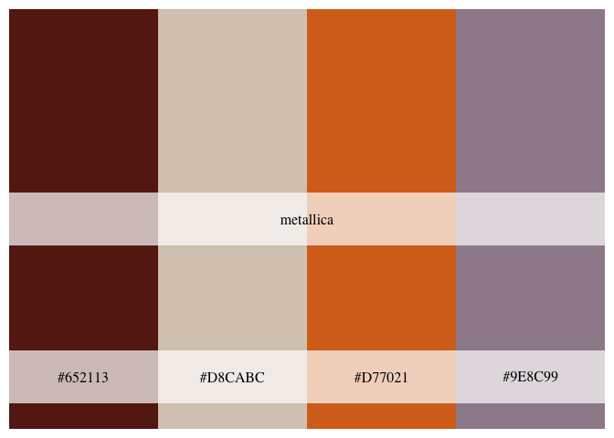<!-- -->

``` r
rock_palette("miles")
```

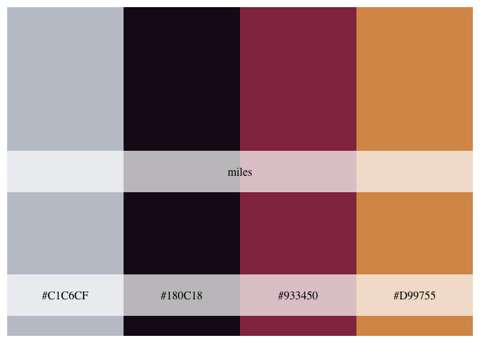<!-- -->

``` r
rock_palette("nevermind")
```

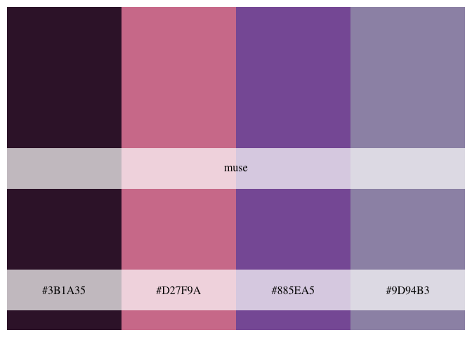<!-- -->

``` r
rock_palette("oasis")
```

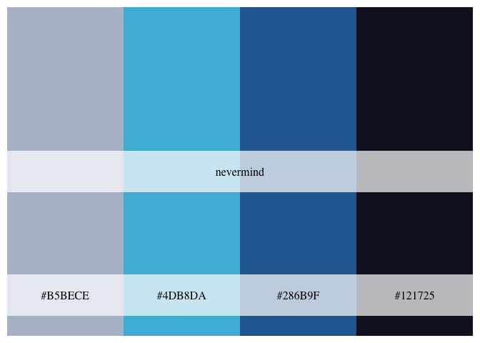<!-- -->

``` r
rock_palette("swift")
```

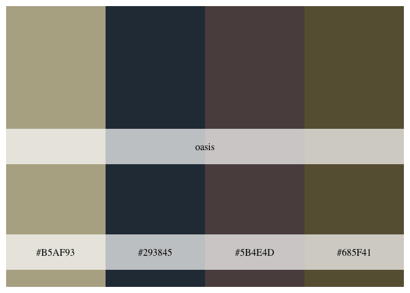<!-- -->

``` r
rock_palette("tencc")
```

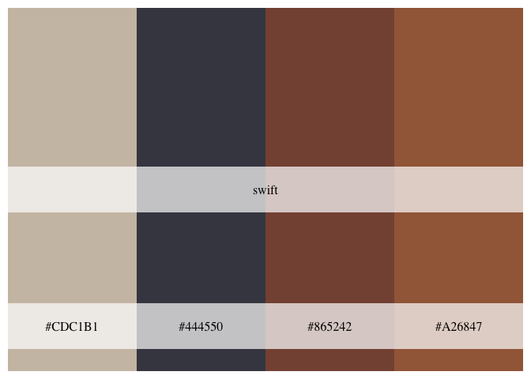<!-- -->

## ggplot2 use

``` r
airquality %>% 
    mutate(Month = as.factor(Month)) %>% 
    ggplot(aes(x = Day, y = Temp, group = Month, color = Month)) +
    geom_line(size = 1.5) +
    scale_color_californication() +
    theme_bw()
```

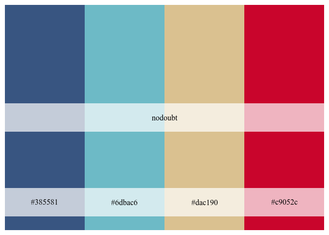<!-- -->

``` r
airquality %>% 
    mutate(Month = as.factor(Month)) %>% 
    ggplot(aes(x = Day, y = Temp, group = Month, color = Month)) +
    geom_line(size = 1.5) +
    scale_color_coltrane() +
    theme_bw()
```

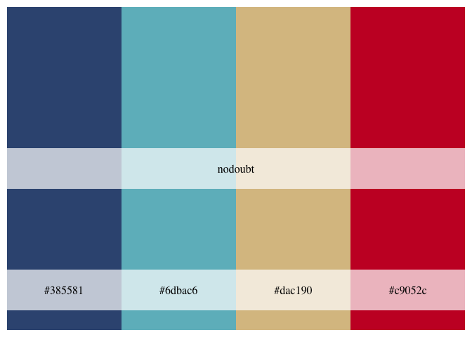<!-- -->

``` r
airquality %>% 
    mutate(Month = as.factor(Month)) %>% 
    ggplot(aes(x = Day, y = Temp, group = Month, color = Month)) +
    geom_line(size = 1.5) +
    scale_color_electric() +
    theme_bw()
```

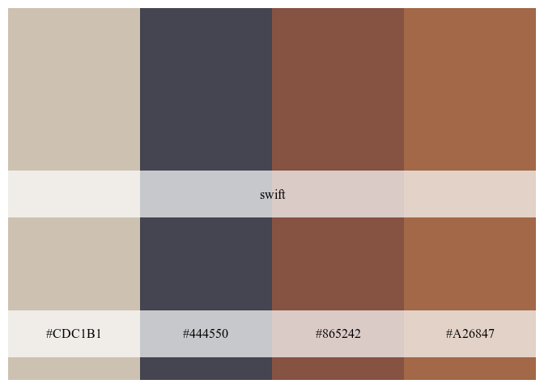<!-- -->

``` r
airquality %>% 
    mutate(Month = as.factor(Month)) %>% 
    ggplot(aes(x = Day, y = Temp, group = Month, color = Month)) +
    geom_line(size = 1.5) +
    scale_color_gogo() +
    theme_bw()
```

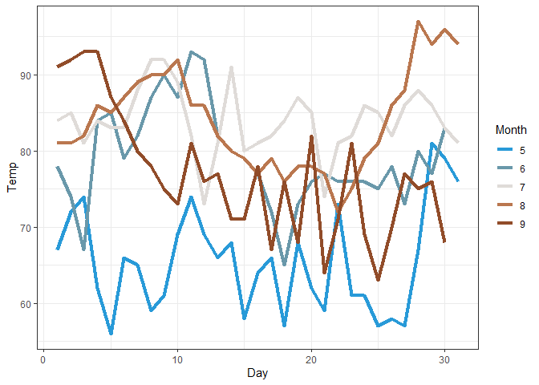<!-- -->

``` r
airquality %>% 
    mutate(Month = as.factor(Month)) %>% 
    ggplot(aes(x = Day, y = Temp, group = Month, color = Month)) +
    geom_line(size = 1.5) +
    scale_color_gunsnroses() +
    theme_bw()
```

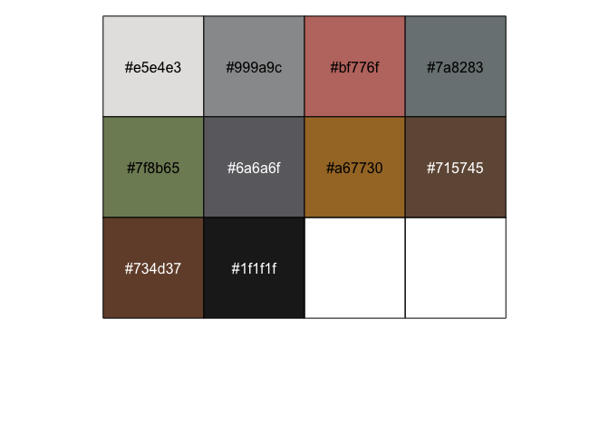<!-- -->

``` r
airquality %>% 
    mutate(Month = as.factor(Month)) %>% 
    ggplot(aes(x = Day, y = Temp, group = Month, color = Month)) +
    geom_line(size = 1.5) +
    scale_color_harvey() +
    theme_bw()
```

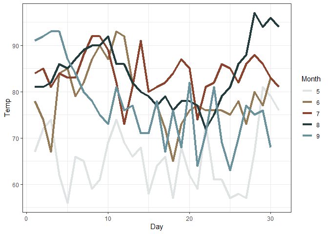<!-- -->

``` r
airquality %>% 
    mutate(Month = as.factor(Month)) %>% 
    ggplot(aes(x = Day, y = Temp, group = Month, color = Month)) +
    geom_line(size = 1.5) +
    scale_color_heap() +
    theme_bw()
```

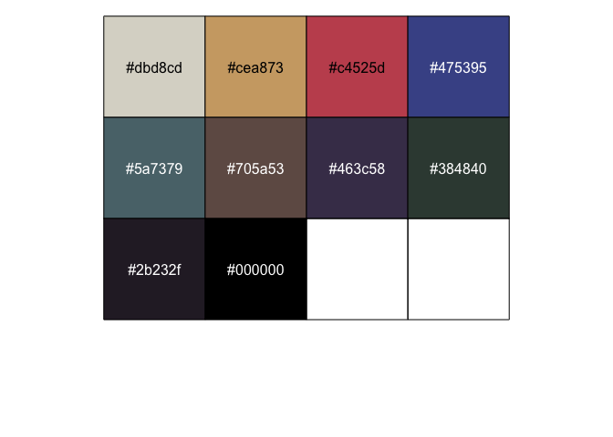<!-- -->

``` r
airquality %>% 
    mutate(Month = as.factor(Month)) %>% 
    ggplot(aes(x = Day, y = Temp, group = Month, color = Month)) +
    geom_line(size = 1.5) +
    scale_color_herb() +
    theme_bw()
```

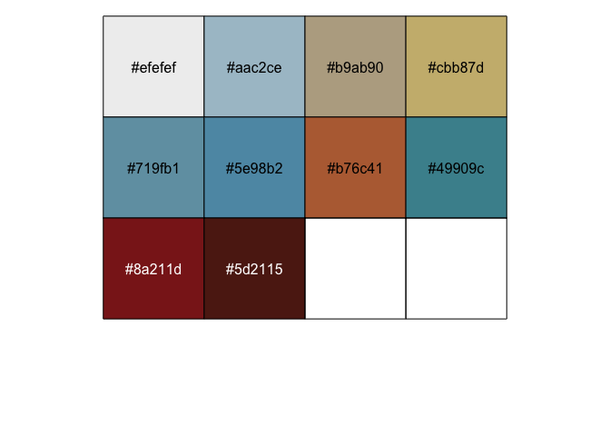<!-- -->

``` r
airquality %>% 
    mutate(Month = as.factor(Month)) %>% 
    ggplot(aes(x = Day, y = Temp, group = Month, color = Month)) +
    geom_line(size = 1.5) +
    scale_color_husker() +
    theme_bw()
```

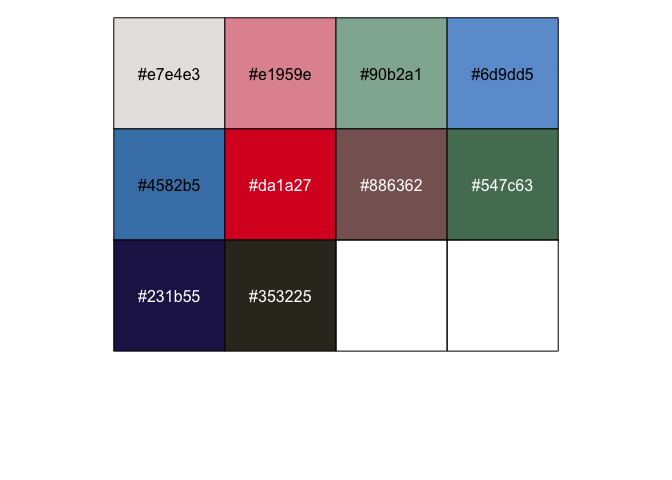<!-- -->

``` r
airquality %>% 
    mutate(Month = as.factor(Month)) %>% 
    ggplot(aes(x = Day, y = Temp, group = Month, color = Month)) +
    geom_line(size = 1.5) +
    scale_color_maiden() +
    theme_bw()
```

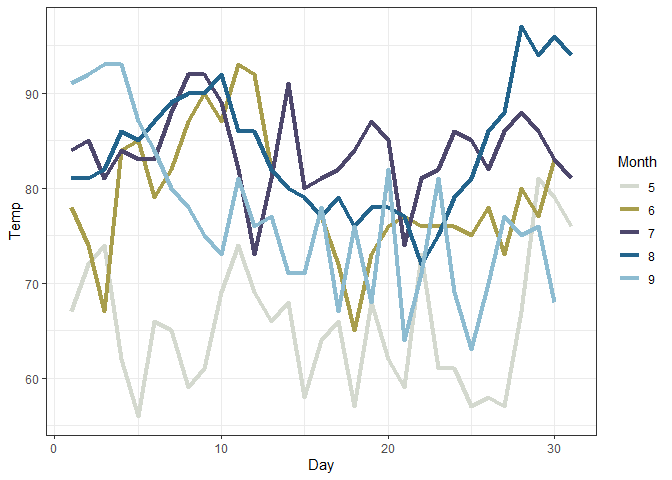<!-- -->

``` r
airquality %>% 
    mutate(Month = as.factor(Month)) %>% 
    ggplot(aes(x = Day, y = Temp, group = Month, color = Month)) +
    geom_line(size = 1.5) +
    scale_color_metallica() +
    theme_bw()
```

<!-- -->

``` r
airquality %>% 
    mutate(Month = as.factor(Month)) %>% 
    ggplot(aes(x = Day, y = Temp, group = Month, color = Month)) +
    geom_line(size = 1.5) +
    scale_color_miles() +
    theme_bw()
```

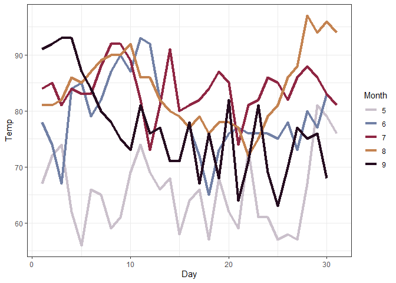<!-- -->

``` r
airquality %>% 
    mutate(Month = as.factor(Month)) %>% 
    ggplot(aes(x = Day, y = Temp, group = Month, color = Month)) +
    geom_line(size = 1.5) +
    scale_color_nevermind() +
    theme_bw()
```

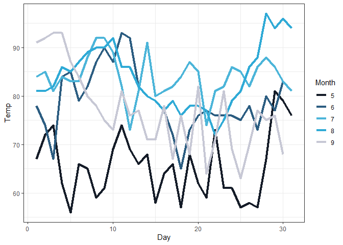<!-- -->

``` r
airquality %>% 
    mutate(Month = as.factor(Month)) %>% 
    ggplot(aes(x = Day, y = Temp, group = Month, color = Month)) +
    geom_line(size = 1.5) +
    scale_color_oasis() +
    theme_bw()
```

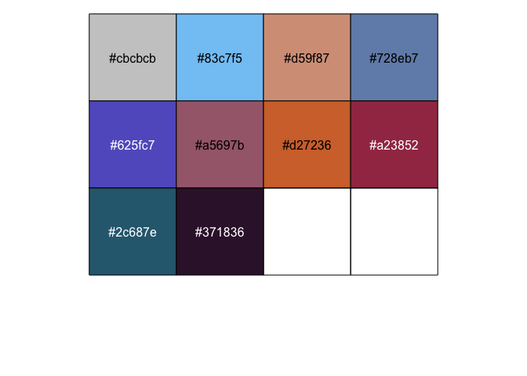<!-- -->

``` r
airquality %>% 
    mutate(Month = as.factor(Month)) %>% 
    ggplot(aes(x = Day, y = Temp, group = Month, color = Month)) +
    geom_line(size = 1.5) +
    scale_color_real_thing() +
    theme_bw()
```

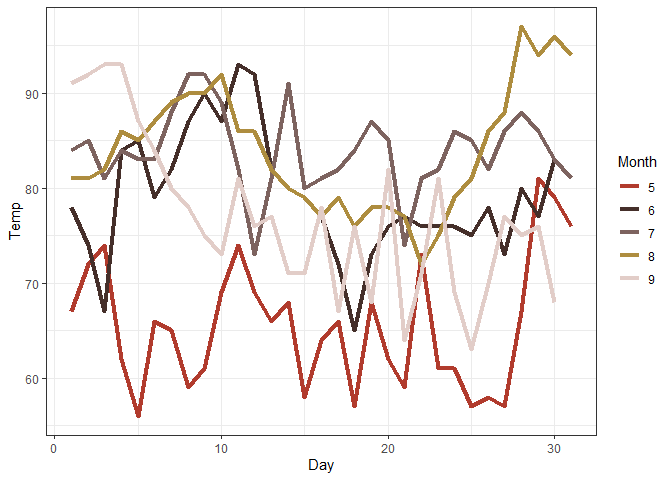<!-- -->

``` r
airquality %>% 
    mutate(Month = as.factor(Month)) %>% 
    ggplot(aes(x = Day, y = Temp, group = Month, color = Month)) +
    geom_line(size = 1.5) +
    scale_color_taylor() +
    theme_bw()
```

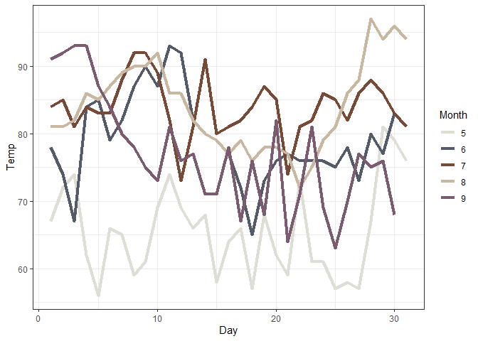<!-- -->

``` r
airquality %>% 
    mutate(Month = as.factor(Month)) %>% 
    ggplot(aes(x = Day, y = Temp, group = Month, color = Month)) +
    geom_line(size = 1.5) +
    scale_color_tencc() +
    theme_bw()
```

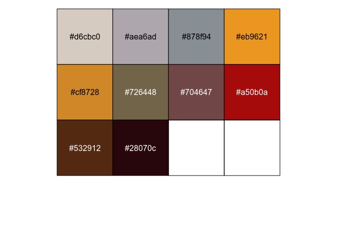<!-- -->
