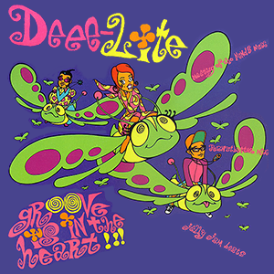

```{r setup, include=FALSE}
knitr::opts_chunk$set(
  collapse = TRUE,
  comment = "#>",
  fig.path = "man/figures/README-",
  fig.height = 2,
  fig.width = 3
)
```


# 

<!-- badges: start -->

[](https://travis-ci.com/johnmackintosh/rockthemes)
  


  <!-- badges: end -->

## What?

This is a collection of colour palettes based on classic rock album covers.

Not all of the artists are 'rock', but they appeared in lists of classic rock album covers and the internet is never wrong, is it ;)

The albums were chosen  either for their striking covers (in terms of colour), or simply, because
they are bona fide rock classics. 

Your job is to guess which is which.


## Why?

Because [this repo of Metallica inspired palettes](https://github.com/johnmackintosh/metallicaRt) has been received quite well on various social media platforms, and I figured that there were other albums with interesting covers that might provide more scope for data visualisation purposes.


## Installation

This will probably not go to CRAN, so please install using the remotes package.

```{r message=FALSE, warning=FALSE}
#library(remotes)
#remotes::install_github("johnmackintosh/rockthemes")
library(rockthemes)
library(ggplot2)
library(dplyr)
library(scales)
library(gapminder)
```

# Palettes and Themes


## Californication

Inspiration

# 

```{r californication, fig.show = "hold",fig.width=3, fig.height=2}
rock_palette("californication")

```


## Coltrane

Inspiration

# 

```{r coltrane}
rock_palette("coltrane")

```

## Deee-Lite

Inspiration 
# 
```{r deelite}
rock_palette("deelite")
```


## Electric

Inspiration

# 

```{r electric}
rock_palette("electric")
```


##  Faith No More

Inspiration

# 

```{r faithnomore}
rock_palette("faithnomore")

```


## Go Gos

Inspiration

# 

```{r gogo}
rock_palette("gogo")

```


## Guns N' Roses

Inspiration

# 

```{r gnr}
rock_palette("gunsnroses")
```


## PJ Harvey

Inspiration

# 

```{r harvey}
rock_palette("harvey")
```


## Uria Heep

Inspiration

# 

```{r heep}
rock_palette("heep")
```


## Hell Awaits - Slayer

Inspiration

# 

```{r slayer}
rock_palette("hellawaits")
```

## Husker Du

Inspiration

# 

```{r husker}
rock_palette("husker")
```


## Janelle Monae

Inspiration

# 

```{r janelle}
rock_palette("janelle")
```


## Iron Maiden

Inspiration

# 

```{r maiden}
rock_palette("maiden")
```


## Metallica 

Inspiration

# 

```{r metallica}
rock_palette("metallica")
```

## Miles Davis

Inspiration

# 

```{r miles}
rock_palette("miles")
```


## Muse

Inspiration

# 

```{r muse}
rock_palette("muse")
```


## Nirvana 

Inspiration

# 

```{r nirvana}
rock_palette("nevermind")
```


## No Doubt

Inspiration

# 

```{r nodoubt}
rock_palette("nodoubt")
```


## Oasis

Inspiration

# 

```{r oasis}
rock_palette("oasis")
```


## Peace Sells - Megadeth

Inspiration

# 

```{r peacesells}
rock_palette("peacesells")
```

## Smashing Pumpkins
Inspiration

# 

```{r melloncollie}
rock_palette("melloncollie")
```


## Taylor Swift

Inspiration

# 

```{r swift}
rock_palette("swift")
```


##  10CC


Inspiration

# 

```{r tencc}
rock_palette("tencc")
```


## Longer colour palettes, more suited for ggplot2 use

The following palettes share the same inspirations, but there are more colours, which hopefully increases their utility for data visualisation.

```{r cal10, fig.show = "hold", out.width = "33%"}
show_col(californication_pal()(10),labels = FALSE)
show_col(coltrane_pal()(10), labels = FALSE)
show_col(deelite_pal()(10),labels = FALSE)
```


```{r electric10, fig.show = "hold", out.width = "33%"}
show_col(electric_pal()(10),labels = FALSE)
show_col(gogo_pal()(10),labels = FALSE)
show_col(gunsnroses_pal()(10),labels = FALSE)

```


```{r harvey10, fig.show = "hold", out.width = "33%"}
show_col(harvey_pal()(10),labels = FALSE)
show_col(heep_pal()(10),labels = FALSE)
show_col(hellawaits_pal()(10),labels = FALSE)

```


```{r husker10,fig.show = "hold", out.width = "33%"}
show_col(husker_pal()(10),labels = FALSE)
show_col(janelle_pal()(10),labels = FALSE)
show_col(maiden_pal()(10),labels = FALSE)
```


```{r metallica10, fig.show = "hold", out.width = "33%"}
show_col(metallica_pal()(10),labels = FALSE)
show_col(miles_pal()(10),labels = FALSE)
show_col(muse_pal()(10),labels = FALSE)

```


```{r nevermind10, fig.show = "hold", out.width = "33%"}
show_col(nevermind_pal()(10),labels = FALSE)
show_col(nodoubt_pal()(10),labels = FALSE)
show_col(oasis_pal()(10),labels = FALSE)
```


```{r megadeth10, fig.show = "hold", out.width = "25%"}
show_col(peacesells_pal()(10),labels = FALSE)
show_col(real_thing_pal()(10),labels = FALSE)
show_col(taylor_pal()(10),labels = FALSE)
show_col(tencc_pal()(10),labels = FALSE)

```


## Credit

[Thanks to Ryo for the tvthemes package](https://github.com/Ryo-N7/tvthemes) which helped me get this off the ground quickly


## Code of Conduct

Please note that the rockthemes project is released with a
[Contributor Code of Conduct](CODE_OF_CONDUCT.md). By contributing to this
project you agree to abide by its terms. 


## Contributing

See the [Contribution guide](.github/CONTRIBUTING.md)


## More ggplot2 examples

```{r, fig.width=5, fig.height=3, echo = FALSE}
data <- gapminder::gapminder %>% 
    filter(country %in% c("France", "Germany", "Ireland", "Italy", "Japan")) %>% 
    mutate(year = as.Date(paste(year, "-01-01", sep = "", format = '%Y-%b-%d')))
  
  
ggplot(data = data, aes(x = year, y = gdpPercap, fill = country)) +
    geom_area(alpha = 0.8) +
    theme_void() + 
    scale_fill_tencc() + 
  ggtitle(label = "scale_fill_tencc")
    
    ggplot(data = data, aes(x = year, y = gdpPercap, fill = country)) +
    geom_area(alpha = 0.8) +
    theme_void() + 
    scale_fill_husker() + 
  ggtitle(label = "scale_fill_husker")
    
    
    ggplot(data = data, aes(x = year, y = gdpPercap, fill = country)) +
     geom_area(alpha = 0.8) +
    theme_void() + 
    scale_fill_janelle() + 
  ggtitle(label = "scale_fill_janelle")
  
    ggplot(data = data, aes(x = year, y = gdpPercap, fill = country)) +
    geom_area(alpha = 0.8) +
    theme_void() + 
    scale_fill_muse() + 
  ggtitle(label = "scale_fill_muse")
    
    ggplot(data = data, aes(x = year, y = gdpPercap, fill = country)) +
    geom_area(alpha = 0.8) +
    theme_void() + 
    scale_fill_nodoubt() + 
  ggtitle(label = "scale_fill_nodoubt")
    
```
